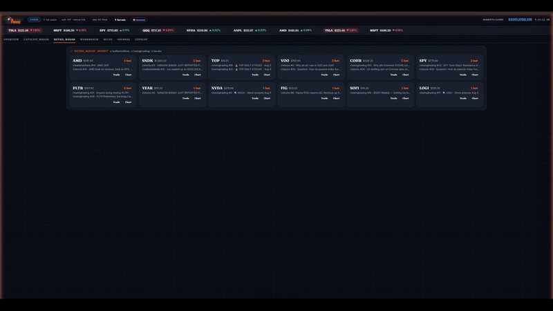
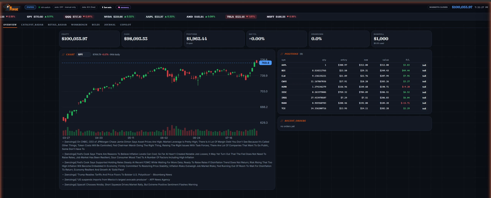
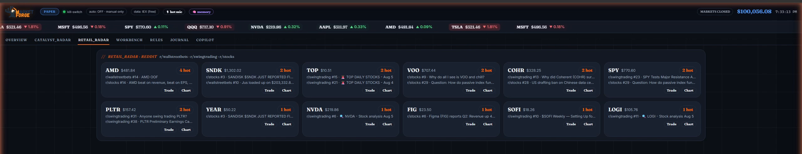
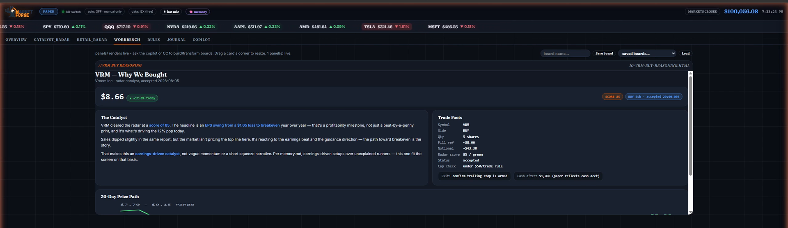
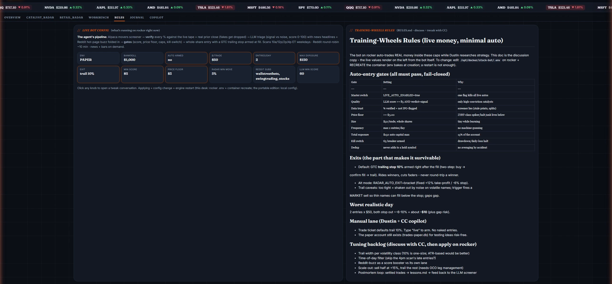
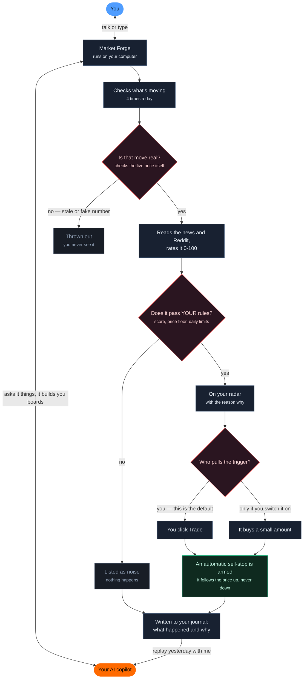
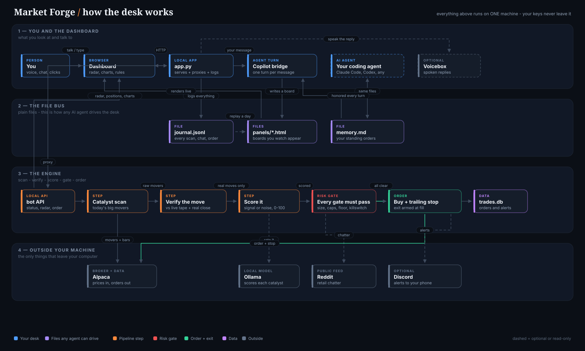

<div align="center">


### Your AI trading desk.

Catalyst radar, hard-coded discipline, and a copilot that builds your board in real time.<br>
**Open source · runs on your machine · your keys never leave it · paper by default**

[](LICENSE)
[](https://python.org)
[](https://discord.gg/JE8TEYZp2f)

[Website](https://madeformeai.com/marketforge) · [Docs](https://docs.madeformeai.com/marketforge/index) · [Discord](https://discord.gg/JE8TEYZp2f) · [Agent install](AGENT-INSTALL.md) · [Dependencies](DEPENDENCIES.md)



<sub><a href="https://youtu.be/Q2wnAheNqRw">▶ Watch the full 100-second narrated demo</a></sub>

</div>

---

## What is this

Market Forge is a **local trading desk with an AI copilot in the seat next to you**.
A scanner engine finds catalyst-driven movers, verifies every number against the
live tape, scores them signal-vs-noise, and enforces hard risk gates. A dashboard
renders it GridPulse-style. And a coding agent (Claude Code, Codex, any of them)
drives the desk through plain files: you talk - by voice or chat - and it builds
boards, replays your trading day, and honors your standing rules on every turn.

It was built by a network engineer learning swing trading who wanted his
discipline **in code, not in willpower**.

## What you need

**Required:** Python 3.10+ · git · Flask (one `pip install`) · a free
[Alpaca](https://alpaca.markets) account (paper keys to start).

**Optional, each unlocking one thing:** an AI coding agent (the copilot) ·
[Ollama](https://ollama.com) (catalyst scoring) · [Voicebox](https://voicebox.sh/) (a natural voice) ·
Chrome/Edge (voice input) · a Discord webhook (phone alerts).

No Docker, no database, no Node, no cloud account. Details: [DEPENDENCIES.md](DEPENDENCIES.md).

## Install

**One-liner (Windows PowerShell):**
```powershell
powershell -c "irm https://madeformeai.com/marketforge/install.ps1 | iex"
```

**One-liner (macOS / Linux):**
```bash
curl -fsSL https://madeformeai.com/marketforge/install.sh | bash
```

**Have your AI agent do it:** say this to Claude Code, Codex, Cursor, any of them.

```
Claude, set up Market Forge on my machine:
https://madeformeai.com/marketforge/setup.md
```

It reads the rest itself, then installs, runs the key wizard *with* you, and learns
your plan. Details: [AGENT-INSTALL.md](AGENT-INSTALL.md).

**Manual:** clone this repo, `pip install -r requirements.txt`, copy
`bot/.env.template` to `bot/.env` with your [Alpaca](https://alpaca.markets) paper
keys, then `run-portable.bat` (Windows) or `MF_EMBEDDED=1 python app.py`.
Full walkthrough: [PORTABLE.md](PORTABLE.md).

> Scripts fallback while the site propagates:
> `irm https://raw.githubusercontent.com/almnjoy/MarketForge/main/install.ps1 | iex`

## The desk

| | |
|---|---|
| **Catalyst radar** | Alpaca movers screener, every % re-verified against real bars and the live tape (stale prints and split artifacts get dropped), LLM triage with news + Reddit hot-page buzz folded in, live "now vs alert" on every card. |
| **Hard-coded discipline** | Fail-closed gates: conviction score floor, price floor, per-trade size, entries/day, total exposure, kill-switch. Every auto-entry exits via a GTC **trailing stop armed at fill** - no naked positions, ever. |
| **The copilot** | Chat or talk (hot-mic, spoken replies). It builds live panels on the Workbench while you watch, honors your `memory.md` standing orders, explains any knob on the RULES tab, and replays your day from the journal - git history for your decisions. |

<div align="center">

<sub>The desk on open: real account, live chart, open positions, and the PAPER badge that ships by default.</sub>


<sub>Retail radar - what r/wallstreetbets, r/swingtrading and r/stocks are actually talking about, ranked by heat.</sub>


<sub>The Workbench. Ask for a board and the copilot writes it while you watch.</sub>


<sub>Every gate, in plain English, exactly as the engine is running it.</sub>
</div>

More of the cockpit: `Ctrl+K` command palette (anything it doesn't recognize goes
to the copilot), saved boards, drag-resizable panels, market-session clock,
activity dock with the agent's real tool steps, and a trade ticket where the
trailing stop is filled in before you ever type "live".

## How it works

In plain English: it watches the market for you, throws out the fake moves,
rates what's left, checks it against **your** rules, and never lets a position
sit without an exit.



**The part that matters:** nothing trades itself unless you deliberately turn
that on, and *every* entry - yours or its - gets an exit armed the moment it
fills. See [rules and risk](https://docs.madeformeai.com/marketforge/rules-and-risk).

<details>
<summary>Under the hood (the technical version)</summary>



Two run modes: `run-portable.bat` = everything in one window (the one you want).
`run.bat` = dashboard only, engine hosted elsewhere.

</details>

## Safety, plainly

Ships in **paper mode** with **auto-trading double-locked off**. Going live is a
deliberate, documented act ([PORTABLE.md](PORTABLE.md)) and starts hard-capped.
The copilot is contractually forbidden (CLAUDE.md) from placing trades or
touching risk settings without your explicit instruction. Market Forge is a
research and education tool - not financial advice; trading involves substantial
risk of loss.

## Community

Questions, setups, and boards worth stealing: [Discord](https://discord.gg/JE8TEYZp2f).
Built by [@almnjoy](https://github.com/almnjoy) · part of the
[MadeForMeAI](https://madeformeai.com) family.

## License

[MIT](LICENSE)
